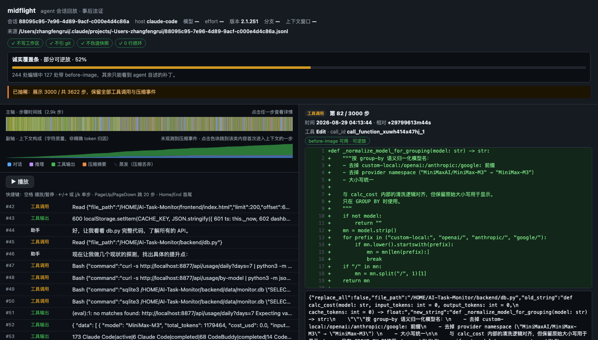
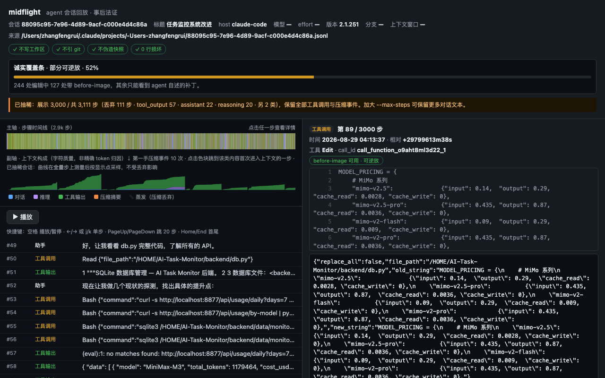

<h1 align="center">midflight</h1>

<p align="center">
  <b>Turn a finished AI coding-agent session into a single scrubbable HTML file you can attach to a PR.</b>
</p>

<p align="center">
  <a href="https://github.com/kevindurant735rocket-creator/midflight-replay/actions/workflows/ci.yml"></a>
  <a href="https://github.com/kevindurant735rocket-creator/midflight-replay/actions/workflows/self-replay.yml"></a>
  <a href="https://www.npmjs.com/package/midflight-replay"></a>
  <a href="#install">= 20"></a>
  <a href="LICENSE"></a>
</p>


<p align="center">
  <a href="#see-it-move">24s replay</a> ·
  <a href="#install">install</a> ·
  <a href="#the-two-outputs">outputs</a> ·
  <a href="#put-it-on-the-pull-request">action</a> ·
  <a href="#honest-coverage">coverage</a> ·
  <a href="#privacy">privacy</a> ·
  <a href="#faq">faq</a> ·
  <a href="README.zh-CN.md">中文</a>
</p>

<p align="center">
  
</p>

---

## See it move

A real Claude Code session from this machine — **32 MB of raw JSONL, 3,111 parsed
steps, 10 first-hand compaction events** — played back in 24 seconds. No mock data,
no hand-written demo fixture: the file was produced by `midflight replay` against a
session log the agent wrote about its own work.

<p align="center">
  
</p>

<p align="center">
  <a href="docs/demo/poster.png"></a>
</p>

What you are looking at, all of it measurable:

- the left axis is **3,000 displayed steps** of 3,111; the banner says so instead of
  pretending the file is complete
- the green area is the **context sawtooth** — it climbs on every turn and drops when
  the host compacts. 10 of those drops are marked `⇣ 第一手压缩事件`
- the right pane is a real `Edit` with a **before-image**, so you can watch the patch
  the agent actually applied, line-numbered
- the coverage bar reads **52%**, because 127 of 244 edits in that session carry a
  before-image and the rest are only visible as the agent's own description

Reproduce it:

```bash
midflight replay ~/.claude/projects/-Users-zhangfengrui/<session>.jsonl --out replay.html
open replay.html
```

`docs/demo/` is regenerated by `node scripts/record-demo.mjs <report.html> --out docs/demo`.

---

## The problem

Here is a real session from this machine, measured with `midflight doctor` — no
rounding, no illustration:

| | |
|---|---|
| log size | **109 MB** |
| steps | **14,905** |
| tool calls | **3,689** |
| of those, file mutations | **1,720** — every one carried by a shell command |
| before-images recorded | **0** |
| context compactions | **22** |

So the log knows *that* each of 1,720 files changed and *which command* changed it,
and it does not know what any of those files looked like beforehand. Twenty-two times
the agent's memory was compacted, and the log records the event but not what survived
it.

The code that came out of this is now a diff. The 109 MB of reasoning that produced
the diff is a file no PR reviewer is going to open. So they read the diff like a
stranger, comment "any way to test this?", and move on. If you want to explain it,
you re-run the agent — which yields a *new* session that does not match the one that
wrote the code.

**midflight replays the session that actually made the code.** Not a summary, not a
report — a scrubbable timeline with the real diffs, the real context accounting, and
an honest statement of how much of it could be reconstructed.

One command:

```bash
npx midflight-replay replay ~/.codex/sessions/2026/09/27/rollout-....jsonl --out replay.html
```

`replay.html` is one self-contained file. No server, no CDN, no build step, no
network requests — it works from `file://`, from a PR comment attachment, from an
air-gapped laptop, from 2030.

---

## Install

Requires **Node 20+**. Nothing else.

```bash
npx midflight-replay replay <session.jsonl> --out replay.html
```

Or pin it — note the binary is `midflight`, so this gives you the `midflight`
command, like `@angular/cli` gives you `ng`:

```bash
npm i -g midflight-replay
midflight doctor <session.jsonl>
```

There is no `npm install` step for the tool itself — it ships zero runtime
dependencies. (The repo's devDependencies exist only to compile and test the source.)

---

## Where are my session logs?

midflight reads the JSONL the agents already write. It never asks you to enable
anything, and it never touches your workspace.

| Agent | Default location | File |
|---|---|---|
| Codex CLI | `~/.codex/sessions/YYYY/MM/DD/` | `rollout-*.jsonl` |
| Claude Code | `~/.claude/projects/<mangled-cwd>/` | `<session-uuid>.jsonl` |

```bash
# newest Codex session
npx midflight-replay replay "$(ls -t ~/.codex/sessions/2026/09/27/*.jsonl | head -1)" --out replay.html

# newest Claude Code session
npx midflight-replay replay "$(ls -t ~/.claude/projects/*/*.jsonl | head -1)" --out replay.html
```

Format is auto-detected from the first intact record, never from the file name, and
never from the directory. A file that is neither format is rejected with a line number.

---

## The two outputs

GitHub strips `<script>` and `<style>` from anything you paste into a comment. Every
HTML exporter dies on that. So midflight has two shapes, and you pick:

### 1. `--out replay.html` — the interactive replay

The full experience. Single file, everything inline.

- **Main axis** — the session timeline, one bar per step, coloured by kind
- **Secondary axis** — stacked context composition (messages / reasoning / tool calls
  / tool output) per step. Click a band or a legend entry to jump to the first step
  carrying it
- **Scrubber** — drag, or `space` play/pause, `←/→` or `j/k` single step,
  `PageUp/PageDown` ±20 steps, `Home/End`. Also clickable
- **Step detail** — payload, token accounting, and for edit steps a **unified diff**
  with line numbers
- **Compaction markers** — where context was compacted, drawn on the axis
- **Honest coverage bar** — see below

Measured on real data: 3,716 of 14,905 steps kept from a 109MB session, 3.24MB output,
scrub under 100ms per step.

### 2. `--paste` — the GitHub-safe digest

```bash
npx midflight-replay replay session.jsonl --paste > digest.html
```

A ≤60KB block containing only `details / summary / table / pre / code / div`.
Zero `<script>`, zero `<style>`, zero `on*=` handlers, zero external references —
machine-asserted in the test suite, not just intended. It is CSS-free by design, so
it stays readable even if a host strips every style attribute.

This is a postmortem digest, not a fake interactive replay, and it does not pretend
to be. If the digest does not fit the budget, sections are dropped in reverse
priority order and the block **says how many were dropped**.

---

## Put it on the pull request

Most reviewers never go looking for a CLI. The action puts the digest where they
already are.

```yaml
# .github/workflows/agent-audit.yml
name: agent audit
on: pull_request
permissions:
  contents: read
  pull-requests: write
jobs:
  replay:
    runs-on: ubuntu-latest
    steps:
      - uses: actions/checkout@v4
      - uses: kevindurant735rocket-creator/midflight-replay@v0.1.0
        with:
          session: auto              # newest .jsonl under .agent-sessions/
          # session: logs/last-run.jsonl
```

It picks a committed session log, builds the paste-safe digest, and leaves **one**
comment on the PR — updated in place, never stacked, so a 40-commit PR does not
accumulate 40 identical digests. The full interactive replay is still yours to
attach by hand; the action posts the readable half.

**What it cannot do:** a CI runner has never run Codex or Claude Code, so there is
no session for it to read unless one is committed. Point `session:` at a file in the
repo, or set `dir:` to wherever yours live.

**What it costs:** one `npm ci` and one `tsc` on a zero-dependency project. This
machine's real 114 MB / 30,736-line / 14,905-step Codex session parses in **433 ms**
and produces a 9,381-byte digest.

This repo runs the action on its own pull requests — see
[`.github/workflows/self-replay.yml`](.github/workflows/self-replay.yml).

## Honest coverage

The single most important design decision here.

A session log does not always contain enough to reconstruct what happened on disk.
Codex writes `cmd` and `path` arguments — **zero** `old_string` / `patch` fields across
3,689 tool calls in the session measured below (`grep -c old_string` → `0` over all
30,736 lines). Claude Code writes `old_string` +
`new_string` for `Edit`, and full `content` for `Write`. So the honest answer differs
per agent, and midflight prints it instead of quietly showing an empty diff:

| Verdict | Meaning |
|---|---|
| `full` | every edit step has a before-image; the replay is reconstructable |
| `partial` | some edits have before-images, some don't — the bar shows the ratio |
| `diff-only` | the log records *that* a file was written, never its prior content |
| `no-edits` | the session made no file edits at all |

Measured, not assumed:

| Session | Size | Parse | Output | Steps | Coverage |
|---|---|---|---|---|---|
| Codex rollout | 109 MB | 379 ms | 3.24 MB | 3,716 / 14,905 | `diff-only` — 1,720 shell-carried mutations, 0 before-images |
| Claude Code | 32 MB | 118 ms | 2.29 MB | 3,000 / 3,111 | `partial` — 244 edits, 127 with before-image |

A second honesty rule: steps the adapter cannot classify are labelled, counted and
**rendered** — never silently dropped. Claude Code writes session-metadata records
(`file-history-snapshot`, `ai-title`, `permission-mode`, …) that carry no agent action,
so midflight now **recognises** them instead of parking them in a bucket: `ai-title` and
`agent-name` become the session title, `file-history-delta` is named chrome, and
`compact_boundary` becomes a first-class compaction event. That last one used to be a
silent lie — the 32 MB session above contains **10** of them, and an earlier build
claimed "no compaction observed" because it swallowed them as chrome.

The result on that session is `unknownCount: 0` across all 3,111 steps:
1,040 tool calls, 1,040 tool outputs, 424 assistant, 415 reasoning, 121 user, 61 notes,
10 compactions. What is *still* deliberately not read is written down in
[`docs/KNOWN-GAPS.md`](docs/KNOWN-GAPS.md) — including why `~/.claude/file-history`
is not decoded, with the command that proves it.

Reproduce both rows yourself:

```bash
npx midflight-replay doctor <session.jsonl> --json   # steps, byKind, parseErrors, unknownSteps
/usr/bin/time -l npx midflight-replay replay <session.jsonl> --out /tmp/r.html --json  # RSS
```

The 109 MB file peaked at **273 MB** RSS (`286,736,384` bytes) — it is streamed
line-by-line and never held in memory whole.

---

## Privacy

**midflight never writes to your workspace, never reads your git history, and never
makes a network request.** Not once, at any code path. The browser acceptance test
asserts zero outbound requests on the generated report.

Redaction is **on by default** and runs before anything reaches the report:

- OpenAI / Anthropic keys, GitHub PATs, Slack tokens, AWS keys, Google API keys
- PEM private-key blocks, `Bearer` headers, JWTs
- `api_key` / `secret` / `password` / `token = ...` assignments
- email addresses
- your home directory → `/HOME`, `/Users/<you>` → `/Users/USER`

Disable with `--no-redact` if you are deliberately debugging a secret. Nothing is
uploaded, so "uploaded" is not a failure mode. The report shows which rules fired
and how many substitutions happened — as counts, never as values.

---

## Commands

```
midflight replay <session.jsonl> [options]   build a self-contained replay
midflight doctor <session.jsonl> [--json]    parse and report health; exit 1 on bad input
midflight stats  <session.jsonl> [--json]    parse and print step counts
midflight redact                            run the redactor over stdin
```

| Option | Default | Meaning |
|---|---|---|
| `--out <file>` | stdout | write HTML here |
| `--paste` | off | emit the GitHub-safe digest instead |
| `--max-steps <n>` | 3000 | tool calls and compaction events are **never** dropped |
| `--per-step-chars <n>` | 1200 | payload cap per step |
| `--no-redact` | off | disable redaction |
| `--json` | off | machine-readable summary on stderr |

`doctor` is the one to run in CI or on a suspect file. It reports the first bad
record **by line number** and exits non-zero.

---

## FAQ

**Does it touch my repository?** No. It reads one JSONL file you name and writes one
HTML file you name. It never reads your git history, never runs git, never writes
inside a project directory.

**Does my session leave my machine?** No. There is no network call at any code path —
a browser assertion checks for outbound requests during interaction and comes back
zero. There is no server, no telemetry, no database, no crash reporting.

**Could it leak my API keys?** Redaction runs before anything reaches the report and
covers OpenAI/Anthropic keys, GitHub PATs, Slack tokens, AWS and Google keys, PEM
private-key blocks, bearer headers, JWTs, `secret = ...` assignments, emails, and
your home directory. The report says which rules fired and how many times, never the
value. `--no-redact` turns it off.

**Why does the coverage bar say `diff-only` on my Codex session?** Because that is
the truth about the log. Codex records `cmd` and `path` arguments; across the 3,689
tool calls in the session I measured, `old_string` and `patch` never appear — not once
in 30,736 lines. The
file *was* changed, but the previous content was never written down, so a diff
cannot be reconstructed. Claude Code's `Edit` steps do record `old_string`, which is
why those sessions land on `full` or `partial`.

**Do I have to instrument my agent first?** No. midflight is forensic, not invasive.
It reads the log the agent already writes. There is no hook, no wrapper, no config
change — which also means it can only report what the log contains, and never claims
more than that.

**Why are there two outputs?** GitHub strips `<script>` and `<style>` from pasted HTML.
An interactive report cannot survive that, so `--paste` emits a digest built only from
whitelisted tags, verified by test to contain no script, no style, no `on*=` handler,
and no external reference.

**Why is the package `midflight-replay` when the command is `midflight`?**
Because the plain name was not available and the mismatch is worth one line of
explanation rather than an ugly binary. Measured, not assumed:

| name | npm | github |
|---|---|---|
| `midflight` | registered, **zero versions** — `npm publish` would fail with EPUBLISHCONFLICT | taken |
| `agent-replay` | taken — v0.1.1, *"DevTools for replaying AI agent sessions"* | 25+ repos share the name |
| `midflight-replay` | free | free |

`docs/RELEASE.md` keeps the probe so you can re-check before anyone squats it.

**Does it work on a session that is still running?** You can, but you get a snapshot
of the file as it is when you read it. midflight is built for sessions that already
ended — a PR that is already open.

**What if it doesn't recognise my agent's format?** `midflight doctor` prints the
first bad record by line number and exits non-zero. If the format is new, open an
issue with a redacted 20-line sample and a step-kind histogram — adapters get added
from measured data.

## Why this and not the other eight tools

There are eight existing projects doing "agent session replay" (measured: 388★,
372★, 268★, 110★, 76★, 14★, 13★, 3★). Three conclusions from looking at all of them:

1. **Session replay is a feature, not a category.** Sentry and PostHog both ship it
   inside a bigger product. `rrweb` — the primitive everyone depends on — has 20k★.
   A standalone viewer is competing for the leftovers.
2. **"Local-first flight recorder" is already taken.** One project's own description
   matches that phrasing almost word for word. It has 76★, a 31,000-character README in
   four languages, MIT, and its last commit was two months before this was written.
   Zero open issues. That is not a product failure; that is a distribution failure.
3. **All eight are tools you use alone.** Nobody's output is meant to leave the
   machine.

midflight is built around the third point. The artifact is a file you send to someone
who was not there. The scenario is reviewing an AI-generated PR, which is happening
right now to a lot of people, and which has a built-in distribution channel that
none of the eight have: the PR comment.

Full measurements, repo-by-repo, with the commands to re-run them:
[docs/COMPETITIVE.md](docs/COMPETITIVE.md).

---

## Roadmap

Deliberately small. Seven things shipped; the next two are the ones with evidence
behind them.

- [x] Codex + Claude Code adapters, auto-detected
- [x] dual-axis timeline with clickable context composition
- [x] unified diffs on edit steps, with line numbers
- [x] dual output: interactive HTML + GitHub-safe digest
- [x] honest coverage verdict on every report
- [x] default-on redaction, zero network
- [x] `doctor` with line-accurate failure reporting
- [ ] **postmortem detection** — flag loops, repeated edits, and near-full context
- [ ] **patch-set export** — reconstruct file state at step *N*, `git apply -R`-able
- [ ] more adapters, as they show up in real logs

Not planned, on purpose: a server, an account, a database, a hosted dashboard, a
re-run/fork feature. Each one needs a network call, and the network call is the
thing this project exists to not do.

---

## Development

```bash
npm install          # devDeps only: typescript, vitest, playwright
npm run build        # tsc -> dist/
npm test             # 39 unit tests
node scripts/browser-check.mjs out.html out2.html   # 60 browser assertions
```

The browser check is a separate command on purpose: it needs a Chromium download, and
CI should not pay for that on every commit.

Format internals for both agent formats are documented in
[docs/FORMATS.md](docs/FORMATS.md).

## Contributing

See [CONTRIBUTING.md](CONTRIBUTING.md). The short version: the zero-dependency and
zero-network constraints are the product, not a preference — a PR that adds a runtime
dependency will not merge.

## License

MIT
