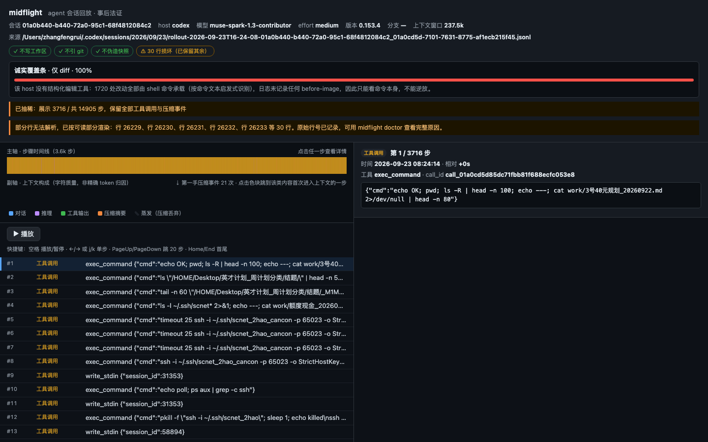

<h1 align="center">midflight</h1>

<p align="center">
  <b>把一条已经结束的 AI 编码 agent 会话，变成一个能拖动、能贴进 PR 评论、且不碰你工作区的单文件。</b>
</p>

<p align="center">
  <a href="https://www.npmjs.com/package/midflight-replay"></a>
  <a href="#安装">= 20"></a>
  <a href="LICENSE"></a>
</p>

<p align="center">
  <a href="#看它动起来">16s 回放</a> ·
  <a href="#安装">安装</a> ·
  <a href="#两种输出">两种输出</a> ·
  <a href="#放到-pr-上">action</a> ·
  <a href="#诚实的覆盖度">诚实的覆盖度</a> ·
  <a href="#隐私">隐私</a> ·
  <a href="#为什么不是另外八个工具">竞品定位</a> ·
  <a href="#路线图">路线图</a> ·
  <a href="README.md">English</a>
</p>

<p align="center">
  
</p>

<p align="center"><sub>真东西，在动。这是一条 32 MB Claude Code 会话的 16 秒 —— 解析出 3,111 步、10 次第一手压缩事件。不是 mock 数据：文件由 <code>midflight replay</code> 对着 agent 自己写的会话日志跑出来。</sub></p>

<p align="center">
  
</p>

<p align="center"><sub>本机真实 Codex 会话 —— 109 MiB 原始 JSONL、14,905 步 —— <strong>0.46 秒</strong>压成 3.4 MiB 单文件。画面里的代码就是真实会话日志。</sub></p>

---

## 看它动起来

本机一条真实 Claude Code 会话——**原始 JSONL 31 MiB，解析出 3,111 步，10 次第一手压缩事件**——压进 16 秒回放。不是 mock 数据，也不是手写 demo 素材：视频里的文件就是 `midflight replay` 对着一条真实会话日志跑出来的。

<p align="center">
  
</p>

<p align="center">
  <a href="docs/demo/poster.png"></a>
</p>

画面里的每个数字都可复现：

- 左侧主轴是 **3,111 步里显示的 3,000 步**；抽稀横幅直接写明，不假装文件是完整的
- 绿色面积是**上下文锯齿**：每轮对话往上爬，宿主压缩时掉下来。其中 10 次标了 `⇣ 第一手压缩事件`
- 右侧是一次真实 `Edit` 的 **before-image**，能看到 agent 实际打进去的补丁，带行号
- 覆盖度条显示 **52%**：那条会话 244 处编辑里只有 127 处带 before-image，其余只能看到 agent 自述

自己复现：

```bash
midflight replay ~/.claude/projects/-Users-zhangfengrui/<session>.jsonl --out replay.html
open replay.html
```

`docs/demo/` 由 `node scripts/record-demo.mjs <report.html> --out docs/demo` 重新生成。

---

## 别信我说的，点开看

仓库里提交了三个真实产物。点开即看 —— 不用装、不用下载、不用注册账号。
每一个都是零外部依赖的单文件。

| | 你会看到 | 打开 |
|---|---|---|
| **交互回放** —— 一条 Codex 会话 | 拖时间轴、点任意一步、读 diff | [打开](docs/demo-codex.html) · 25 KB |
| **交互回放** —— 一条 Claude Code 会话 | 带压缩锯齿事件的那条 | [打开](docs/demo-claude.html) · 47 KB |
| **PR 摘要块** —— GitHub 安全 | 你真正贴进 review 评论的那一份 | [打开](docs/demo-claude-paste.html) · 1 KB |

第三个才是这个项目的重点。GitHub 会剥掉 `<script>` 和 `<style>`，所有 HTML
导出器都会在 PR 评论里死掉；那一份只用 `details / summary / table / pre /
code / div` 生成，贴进去还能原样存活。它只有 1 KB —— 所以有人会读。

## 问题在哪

这是本机一条真实会话，用 `midflight doctor` 量出来的，没有四舍五入、没有示意图：

| | |
|---|---|
| 日志体积 | **109 MiB** |
| 步数 | **14,905** |
| 工具调用 | **3,689** |
| 其中改动文件 | **1,720** 次 —— 全部由 shell 命令承载 |
| 记录了改前内容的 | **0** 次 |
| 上下文压缩 | **22** 次 |

也就是说：日志知道这 1,720 个文件被改过、也知道是哪条命令改的，却不知道任何一个文件
改之前长什么样。上下文被压缩了 22 次，日志记下了"发生过"，但没记下"什么活了下来"。

从这次会话里产出的代码，现在只剩一个 diff。而产生这个 diff 的 109 MiB 推理过程，
没有哪个 PR 评审人会去打开。于是他们像陌生人一样读 diff，评论一句"这个怎么测"，翻篇。
想解释？重跑一次 agent —— 得到的是一个**新**会话，和当初写出代码的那条已经不是同一条。

**midflight 回放的是真正写出那份代码的那条会话。** 不是摘要，不是报告 ——
是一条可以来回拖动的时间轴，带真实的 diff、真实的上下文用量，以及一句诚实的
话：这个会话到底有多少比例能重建。

一条命令：

```bash
npx midflight-replay replay ~/.codex/sessions/2026/09/27/rollout-....jsonl --out replay.html
```

`replay.html` 是单个自包含文件。不用起服务、不用 CDN、不用构建、不发任何网络请求 ——
从 `file://` 打开能用，贴成 PR 附件能用，断网笔记本能用，2030 年还能用。

零依赖、零构建、零网络请求、零遥测。

---

## 安装

需要 **Node 20+**，别的都不要。

```bash
npx midflight-replay replay <session.jsonl> --out replay.html
```

或者装到全局 —— 注意二进制命令叫 `midflight`，就像 `@angular/cli` 装出来的是 `ng`：

```bash
npm i -g midflight-replay
midflight doctor <session.jsonl>
```

工具本身不需要 `npm install` —— 运行时依赖是 0 个。仓库里的 devDependencies 只用于
编译和测试源码。

---

## 六十秒，从 clone 到能看的回放

```bash
git clone https://github.com/kevindurant735rocket-creator/midflight-replay.git
cd midflight-replay && npm install && bash scripts/demo-60s.sh --self
```

这就是整个 demo。它会自动找到你机器上最大的真实会话日志（`~/.codex` 或 `~/.claude`），
回放它，然后把它干了什么打印出来：

```
  input        110 MiB of raw JSONL
  output       3.4M, one file, no sibling assets
  wall clock   454 ms
 { "kept": 4016, "total": 14905, "coverage": "diff-only", "parseMs": 387 }

done in 53 ms — open it:
  open demo-60s.html
```

这些数字是**在跑它的机器上实测的**，不是从 benchmark 抄的。去掉 `--self` 就用内置
fixture 跑 53 ms 那条路径，不需要任何会话日志。

---

## 支持哪些智能体

`midflight agents` 扫的是**你本机**的日志目录，每跑一次都是实测：

```
$ midflight agents --probe
agent                 status       sessions   size        newest
--------------------  -----------  ---------  ----------  -----------------
Codex CLI             readable     833        628.0 MB    2026-09-28
Claude Code           readable     173        226.9 MB    2026-09-27
Cursor                no adapter   1          8.6 KB      2026-08-31
...
2 of 3 installed agents readable; 8 not installed on this machine.
  ✓ Codex CLI: newest log: 2269 steps, 0 parse errors
  ! Cursor: no adapter — Cursor keeps chat state in a private store, not a JSONL transcript (1 file(s) found)
```

`--probe` 会**真去解析**每个可读智能体最新的那份日志，所以"readable"的意思是
"这份文件刚刚解析通过了"，不是"应该能行"。装了但读不了的智能体不会被藏起来，而是
连真实文件数一起列出来。注册表覆盖 11 个宿主，目前 Codex 和 Claude Code 是完整
adapter，其余每一行都写清了为什么还不支持。

### 装进你自己的智能体

```bash
midflight install codex        # 只写一个文件：~/.codex/skills/midflight-replay/SKILL.md
midflight install --all        # 所有已知宿主
midflight install --dry-run    # 只打印路径，不写盘
```

只写一个 `SKILL.md`，别的什么都不碰 —— 没有 hook、没有常驻进程、不改配置、不联网。
这是故意的：midflight 读的是智能体自己已经写下的日志，没有东西需要拦截；而给一个
长会话套一层壳子，只会多一个能把会话搞崩的东西。这个 skill 是纯 Markdown，装之前
你能自己读完；不带 `--force` 时它拒绝覆盖已存在的不同文件；skill 里写的每条命令
都有测试断言在同一个构建里真的存在。

| 宿主 | 路径 | 文件 |
|---|---|---|
| Codex CLI | `~/.codex/skills/midflight-replay/` | `SKILL.md` |
| Claude Code | `~/.claude/skills/midflight-replay/` | `SKILL.md` |
| opencode | `~/.config/opencode/skill/midflight-replay/` | `SKILL.md` |
| Gemini CLI | `~/.gemini/skills/midflight-replay/` | `SKILL.md` |
| Cursor | `~/.cursor/rules/midflight-replay/` | `*.mdc` |
| Windsurf | `~/.codeium/windsurf/rules/midflight-replay/` | `*.md` |
| GitHub Copilot | `~/.github/prompts/midflight-replay/` | `*.prompt.md` |

各宿主的 frontmatter 是按各自的加载规则生成的（Codex/Claude Code/opencode/Gemini
要 `name`+`description`，Cursor 只要 `description`，Copilot prompt 不要），这条映射
有测试锁死，不是把 README 换个文件名。

---

## 我的会话日志在哪

midflight 读的是 agent 本来就在写的 JSONL。它不要求你打开任何开关，也**不碰你的工作区**。

| Agent | 默认位置 | 文件 |
|---|---|---|
| Codex CLI | `~/.codex/sessions/YYYY/MM/DD/` | `rollout-*.jsonl` |
| Claude Code | `~/.claude/projects/<转义后的工作目录>/` | `<session-uuid>.jsonl` |

```bash
# 最新的 Codex 会话
npx midflight-replay replay "$(ls -t ~/.codex/sessions/*/*/*/*.jsonl | head -1)" --out replay.html

# 最新的 Claude Code 会话
npx midflight-replay replay "$(ls -t ~/.claude/projects/*/*.jsonl | head -1)" --out replay.html
```

格式靠第一条完整记录**结构上**识别，不看文件名、不看目录名。两种都不认的话，
会带行号报错退出。

---

## 两种输出

GitHub 会把粘进评论里的 `<script>` 和 `<style>` 全部剥掉。所有 HTML 导出器都死在这。
所以 midflight 有两种形态，你选：

### 1. `--out replay.html` —— 交互件

完整体验，单文件全内联。

- **主轴** —— 会话时间轴，每步一根条，按类型着色
- **副轴** —— 堆叠的上下文构成（消息 / 推理 / 工具调用 / 工具输出）。点色块或图例，
  直接跳到第一个含该类别的步
- **播放器** —— 可拖动；`空格` 播放/暂停，`←/→` 或 `j/k` 单步，
  `PageUp/PageDown` 跳 20 步，`Home/End` 首尾。也可直接点
- **单步详情** —— payload、token 用量；编辑步给**带行号的 unified diff**
- **压缩标记** —— 上下文在哪里被 compact，画在轴上
- **诚实覆盖条** —— 见下

实测（真实数据）：109 MiB 会话里保留 14,905 步中的 4,016 步，输出 3.38MB，
每步 scrub 延迟 <100ms。

### 2. `--paste` —— GitHub 安全块

```bash
npx midflight-replay replay session.jsonl --paste > digest.html
```

≤60KB，只含 `details / summary / table / pre / code / div`。零 `<script>`、
零 `<style>`、零 `on*=` 内联事件、零外部引用 —— 这些由测试机检断言，不是口头承诺。
它按设计就是无 CSS 的：即使宿主把所有 style 属性剥光，仍然可读。

它是一份事后解剖摘要，**不假装**自己是可交互回放。放不下的时候按优先级倒序丢段，
并且**明说丢了多少**。

---

## 放到 PR 上

大部分审阅者不会去找一个 CLI。action 把摘要放到他们本来就在的地方。

```yaml
# .github/workflows/agent-audit.yml
name: agent audit
on: pull_request
permissions:
  contents: read
  pull-requests: write
jobs:
  replay:
    runs-on: ubuntu-latest
    steps:
      - uses: actions/checkout@v4
      - uses: kevindurant735rocket-creator/midflight-replay@v0.1.0
        with:
          session: auto              # .agent-sessions/ 下最新的 .jsonl
          # session: logs/last-run.jsonl
```

它读仓库里已提交的会话日志，生成可直接粘贴的摘要，在 PR 上留 **一条** 评论 ——
原地更新、不堆叠，所以 40 个 commit 的 PR 不会攒出 40 份一模一样的摘要。
完整的可交互回放仍然由你自己手动附上；action 只发读得懂的那一半。

**它做不到什么：** CI runner 从来没跑过 Codex 或 Claude Code，所以除非你把日志
提交进仓库，否则它没有会话可读。把 `session:` 指向仓库里的文件，或者用 `dir:`
指到你自己的日志目录。

**它花多少：** 一次 `npm ci` 加一次 `tsc`，项目零运行时依赖。本机真实的
109 MiB（114,325,714 字节）/ 30,736 行 / 14,905 步 Codex 会话解析耗时 **< 500ms**，产出 9,381 字节摘要。

这个仓库在自己的 PR 上跑这个 action ——
见 [`.github/workflows/self-replay.yml`](.github/workflows/self-replay.yml)。

---

## 诚实的覆盖度

这是整个项目最重要的一个设计决定。

会话日志不一定包含足够信息来重建磁盘上发生的事。Codex 只写 `cmd` 和 `path` 参数 ——
在实测的那条会话里，3,689 次 tool_call、30,736 行日志中，`old_string` / `patch` 出现次数为**零**。
Claude Code 的 `Edit` 带 `old_string` + `new_string`，`Write` 带完整 `content`。

所以诚实的答案因 agent 而异。midflight 把它印出来，而不是给你看一个空 diff 却什么都不说：

| 判定 | 含义 |
|---|---|
| `full` 全可逆放 | 每个编辑步都有 before-image，会话可重建 |
| `partial` 部分可逆放 | 部分编辑步有 before-image，覆盖条显示比例 |
| `diff-only` 仅 diff | 日志记了"写过这个文件"，但没记之前的内容 |
| `no-edits` 无编辑 | 这条会话根本没改文件 |

实测数据，不是推测：

| 会话 | 大小 | 解析 | 输出 | 步数 | 覆盖判定 |
|---|---|---|---|---|---|
| Codex rollout | 109 MiB | ~0.4 s | 3.38 MiB | 4,016 / 14,905 | `diff-only` —— 1,720 处 shell 改动，0 处 before-image |
| Claude Code | 31 MiB | ~0.13 s | 2.19 MiB | 3,000 / 3,111 | `partial` —— 244 次编辑，127 次带 before-image |

第二条诚实规则：适配器无法分类的步会被**标注、计数并渲染**，绝不静默丢弃。Claude Code 会写入
会话元数据记录（`file-history-snapshot` / `ai-title` / `permission-mode` 等），它们不承载
agent 动作 —— 所以 midflight 现在**认得出**它们，而不是丢进一个桶里：`ai-title` 与
`agent-name` 直接变成会话标题，`file-history-delta` 归为 chrome，`compact_boundary`
变成一等的压缩事件。最后这条以前是个沉默的谎报：上面那条 32MB 会话里有 **10** 个
`compact_boundary`，早期版本把它们当 chrome 吞掉，于是报告写「未观测到压缩事件」。

现在那条会话的 `unknownCount: 0`，全部 3,111 步分布是：1,040 工具调用、1,040 工具输出、
424 assistant、415 reasoning、121 user、61 note、10 次压缩。**故意不读**的部分写在
[`docs/KNOWN-GAPS.md`](docs/KNOWN-GAPS.md) —— 包括为什么不解码 `~/.claude/file-history`，
以及证明这件事的命令。接下来做什么、明确不做什么，排序在
[`docs/BACKLOG.md`](docs/BACKLOG.md)。

两行都可以自己复现：

```bash
npx midflight-replay doctor <session.jsonl> --json   # steps / byKind / parseErrors / unknownSteps
/usr/bin/time -l npx midflight-replay replay <session.jsonl> --out /tmp/r.html --json  # RSS
```

那个 109 MiB 的文件峰值 RSS **273MB**（`286,736,384` 字节）。解析是逐行流式的，从不整文件读进内存。

---

## 隐私

**midflight 不写你的工作区、不读你的 git 历史、不发任何网络请求。** 一次都没有，
任何代码路径都没有。生成的报告有浏览器验收断言：零外部请求。

脱敏**默认开启**，在任何东西进入报告之前就跑完：

- OpenAI / Anthropic key、GitHub PAT、Slack token、AWS key、Google API key
- PEM 私钥块、`Bearer` 头、JWT
- `api_key` / `secret` / `password` / `token = ...` 赋值
- 邮箱地址
- 你的家目录 → `/HOME`，`/Users/<你>` → `/Users/USER`

如果你是故意在调试某个密钥，用 `--no-redact` 关掉。没有任何东西被上传，所以
"被上传"不构成失败模式。报告里只显示**哪条规则命中了几次**，永远不显示值。

---

## 命令

```
midflight replay <session.jsonl> [options]   生成自包含回放
midflight doctor <session.jsonl> [--json]    解析并体检；输入有问题时 exit 1
midflight stats  <session.jsonl> [--json]    解析并打印步数统计
midflight postmortem <session.jsonl> [--json] 数循环、反复改同一处、上下文压力
midflight revert  <report.html> --step <n>    打印撤销第 n 步所需的补丁
midflight revert  <report.html> --list       列出哪些步骤可逆放
midflight agents [--json] [--probe]         本机装了哪些智能体、哪些读得了
midflight install <agent>|--all [--dry-run]  把 midflight skill 装进那个智能体
midflight redact                            对 stdin 跑脱敏
midflight --version                          打印已安装的版本
```

| 选项 | 默认 | 含义 |
|---|---|---|
| `--out <file>` | stdout | HTML 写到这里 |
| `--paste` | 关 | 改输出 GitHub 安全块 |
| `--max-steps <n>` | 3000 | 工具调用和压缩事件**永不丢弃** |
| `--per-step-chars <n>` | 1200 | 每步 payload 上限 |
| `--no-redact` | 关 | 关脱敏 |
| `--json` | 关 | 机器可读摘要走 stderr |

文件可疑的时候跑 `doctor`。它会报出**第一条坏记录的行号**，并以非零码退出。
可以放进 CI。

### `revert` —— 报告的逆运算

报告能证明 agent 做了什么。`revert` 把其中一步变回一个补丁：

```
midflight revert replay.html --list                    # 哪些步可以撤
midflight revert replay.html --step 42 --out p.diff   # 写出补丁
git apply --check -R p.diff                           # 先验
git apply -R p.diff                                   # 看完再撤
```

它**绝不写你的工作区** —— 唯一会写的是 `git apply`，由你亲自下，你已经先看过补丁。
`--list` 只需要报告本身，所以同事没你的 checkout 也能看出哪些步可撤。

某一步如果没有可恢复的 before-image，`revert` 会**非零退出并明确拒绝**，
而不是吐一个空补丁。悄悄给一个空操作贴上"已撤销"的标签，比直接说不行更糟。

---

## 为什么不是另外八个工具

现在已经有八个项目在做"agent 会话回放"（实测星标：388 / 372 / 268 / 110 / 76 /
14 / 13 / 3）。把八个都看过一遍之后，三条结论：

1. **会话回放是功能，不是品类。** Sentry 和 PostHog 都把它当更大产品里的一个功能。
   底层原语 `rrweb` 有 2 万星。独立 viewer 是在抢边角料。
2. **"本地优先飞行记录仪"这个说法已经有人占了。** 有一个项目自己的描述和这句话
   几乎逐字重合 —— 76 星、四种语言、31,000 字符的 README、MIT 许可，
   停更两个月，开源 issue 数为零。这不是产品失败，是分发失败。
3. **八个全是"你自己一个人用"的工具。** 没有一个的产物是为"发出去"设计的。

midflight 押的是第三条。产物是一个**发给不在场的人**的文件。场景是评审 AI 生成的 PR
—— 此刻正在大规模发生 —— 而且这个场景自带一个裂变位，那八个都没有：PR 评论。

逐仓库的实测数据和可复跑的取证命令：[docs/COMPETITIVE.md](docs/COMPETITIVE.md)。

---

## 如果你是在 npm 上搜"agent replay"搜到这儿的

你搜到两个包。下面的数字是**当场实测**的，取证命令在
[docs/COMPETITIVE.md](docs/COMPETITIVE.md)：

| | `agent-replay` | `flightrec` | **midflight-replay** |
|---|---|---|---|
| npm 版本 | 0.1.1 | 0.9.0 | **0.1.0** |
| 最后发布 | 2026-02-16 | 2026-07-15 | 今天 |
| 月下载 | 9 | 16 | — |
| GitHub 仓库 | **404，已删或转私有** | **0★**，建仓和最后 push 同一天 | 公开，CI 全绿 |
| 它是什么 | "DevTools for replaying AI agent sessions" | "A flight recorder for Codex sessions" | 一个**贴到 PR 上的文件** |
| 源码 | 未公开 | 未公开 | **完整开源，MIT** |

关键差别不是功能。是那两个包**装上也验证不了**：一个仓库根本访问不到，另一个
仓库从建仓起就没过第二个提交。你读不了源码，提不了 issue，也没法确认它现在还能不能跑。

所以这里的验收标准刻意选成最便宜、也最没法作假的那条：**装上它，做出一个东西。**

```bash
npx midflight-replay replay "$HOME"/.claude/projects/*/*.jsonl --out replay.html
```

这条命令要是能产出一个你直接发给"问你这个问题的人"的文件，比较就结束了。
上面那台机器上，110 MiB 的 JSONL 在 0.46 秒内变成 3.4 MiB 的单文件 HTML，
全程不碰网络。

---

## 路线图

刻意做小。已发货 9 项，没有第 11 项排在后面充数。

- [x] Codex + Claude Code 适配器，自动识别
- [x] 双轴时间轴 + 可点击的上下文构成
- [x] 编辑步的 unified diff，带行号
- [x] 双输出：交互 HTML + GitHub 安全块
- [x] 每份报告都带诚实覆盖判定
- [x] 默认脱敏、零网络
- [x] `doctor` 行级失败定位
- [x] `revert` —— 从报告里撤一步，可 `git apply -R`
- [x] `postmortem` —— 循环、反复改同一处、上下文压力，全部从日志数出来
      （同一块面板也进了 HTML 报告：每条发现一行，点一下就跳到起头那一步）
- [ ] 更多适配器，等真实日志里出现再加 —— 不预先排任何一家

**刻意不做**：服务端、账号、数据库、托管看板、重跑/分叉。每一个都需要一次网络调用，
而"不发网络请求"正是这个项目存在的理由。

---

## 开发

```bash
npm install          # 只有 devDeps：typescript、vitest、playwright
npm run build        # tsc -> dist/
npm test             # 39 个单测
node scripts/browser-check.mjs out.html out2.html   # 两条 fixture 上 62 条浏览器断言；条数随输入变
```

浏览器验收是单独一条命令，这是故意的：它要下载 Chromium，CI 不该每次提交都付这个成本。

两种 agent 格式的内部结构见 [docs/FORMATS.md](docs/FORMATS.md)。

## 贡献

见 [CONTRIBUTING.md](CONTRIBUTING.md)。一句话版本：零依赖和零网络不是偏好，是产品本身 ——
加了运行时依赖的 PR 不会合。

## 许可

MIT
